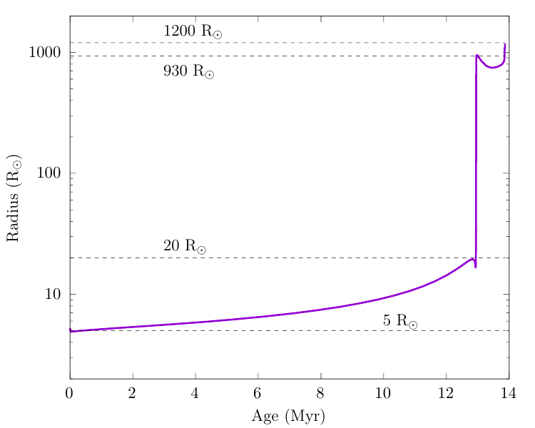

Here is a downloadable copy of the desired [Lab1_binary](https://drive.google.com/file/d/1I6MnPMCoP70sHlNo4NWNYZYrRpX5UzUm/view?usp=share_link) MESA work directory.
This work directory is a slightly modified version of the `$MESA_DIR/binary/test_suite/evolve_both_stars` test_suite.

## MiniLab1 - Modeling a star through envelope stripping


Assume that we have a binary star system where the components are close enough to undergo Roche Lobe overflow (RLOF) from the inner L1 Lagrangian point. Additionally, assume that both components do not have the same mass so that the evolution of one star slightly lags the other star. In the lab, we would like to explore how the primary - more massive - star evolves in such a binary.

Since here we are primarily interested in the evolution of the primary, to save some computation time we are going to approximate the secondary as a point mass further. In other words, we are not going to model the evolution of the secondary. Then, later in Section~\ref{subsec: evolve both stars}, we will relax this assumption and evolve both stars in detail.

### The evolution of the primary star

Using the downloaded `Lab1_binary` directory,we will begin by modeling this system as a star + point mass. To do this, open `inlist_project` and make sure to set `evolve_both_stars = .false.`.

In the `&binary_controls`, you should see the following lines:

```
   m1 = 15d0  ! donor mass in Msun
   m2 = 12d0 ! companion mass in Msun
   initial_period_in_days = 6d0
```
Let's start by assuming fully conservative mass transfer, i.e. ($\beta$ == 1).

For this lab we will keep the companion/accretor mass fixed at **`m2 = 12d0`**, do not adjust this mass. We will explore the binary evolution of our system with varying periods and mass ratios *m1/m2* by modifying `initial_period_in_days` and `m1`. We will explore the following mass range $M_{1} = 12.5 - 30 M_{\odot}$ and periods $Period = 2 - 200$ days. We've descritized this parameter space in the following two tables:

| Primary (Donor) Mass ( $M_{\odot}$ ) |   
|:------------------------|
| 12.5      |
| 15        |
| 20        |
| 25        |
| 30        |

| Period (days) |     
|:--------------|
| 2        | 
| 4        | 
| 6        | 
| 8        |
| 15       |
| 20       |
| 25       |
| 30       |
| 50       |
| 100       |
| 200        | 

Now choose a value for the initial mass and period of the binary system from this table by entering your name in the row next to the corresponding mass and period in the [Day 4 Massive Binaries Lab1 tab in Google sheets](https://docs.google.com/spreadsheets/d/1__UPg_5JfiBkJpZTleyaSwW_faxHzmo_X7Us2RTfLOM/edit?usp=sharing). With `inlist_project` open, fill in your chosen values of Primary Mass and Period from the spread sheet.


Before running our model, let's uncomment some values from the `history_columns.list` and `profile_columns.list` so we can plot in our `&pgbinary` plots.


We want our binary evolution to terminate when the mass transfer phase is complete. All forms of mass transfer A, B, and C are typically complete by the time the primary has reached core-Helium depletion, as the timescale for stable mass transfer is significantly shorter than either the H or He burning lifetime.

In `inlist1`, set a stopping condition such that the model terminates when the primary reaches helium depletion. Let's terminate the model when $X$({$^4$He}) $\leq$ 1d-4:


```plaintext
      xa_central_lower_limit_species(1) = 'he4'
      xa_central_lower_limit(1) = 1d-4
```


Now, we will run the model. As before, for this, we need to execute the below commands in the terminal

```
./mk
./rn
```


The model should take roughly 7 minutes to run on a 4 core machine, so let's use this time to modify our pgstar to output some quantities of interest.


**Here are some questions to discuss at your table and answer while your model evolves**

1. What is the mass ratio of your system
2. What type of mass transfer does your system undergo? Case A, B, C?
3. Is the mass transfer in your system stable or unstable?
4. What is the approximate mass of your primary when the mass transfer phase ends?

In the [Day 4 Massive Binaries Lab1 tab in Google sheets](https://docs.google.com/spreadsheets/d/1__UPg_5JfiBkJpZTleyaSwW_faxHzmo_X7Us2RTfLOM/edit?usp=sharing), fill in each column for your chosen values so we can discuss the global results as a class.

| M_primary / M_accretor |   M_primary Final |   M_accretor Final | Type of Mass transfer (A, B, C?) | Stable or unstable? | Final Period (days) |


## What kind of outcomes to expect


Mass transfer in binary systems are often classified based on which burning stage the donor star is in. This is because stars have very different structures depending on the burning stage and therefore respond to mass loss in completely different ways.

<dl>
  <dt> Case A mass transfer </dt>
       <dd> Mass transfer from a core hydrogen burning star (main sequence star). It often starts off with a rapid phase (thermal timescale) and followed by a slower phase (nuclear timescale).</dd>
  <dt> Case B mass transfer </dt>
       <dd> Mass transfer from a core hydrogen depleted star (post-main sequence star).  </dd>
  <dt> Case C mass transfer </dt>
       <dd> Mass transfer from a core helium depleted star. </dd>
</dl>

How do we know which type of mass transfer occurs? This can be done by simply comparing the size of the star during various burning stages to the size of its  Roche lobe.


The Roche lobe size can be estimated with the following formula

$$
\frac{R_\mathrm{rl}}{a} = \frac{0.49q^{2/3}}{0.6q^{2/3}+\ln{(1+q^{1/3})}}\equiv f(q)
$$

Here, $R_\mathrm{rl}$ is the volume equivalent Roche lobe radius of the donor, $a$ is the orbital semimajor axis and $q\equiv M_\mathrm{d}/M_\mathrm{a}$ is the mass ratio of the donor to accretor. Mass transfer occurs when the stellar radius exceeds the Roche lobe radius $R_\mathrm{d}>R_\mathrm{rl}$.

### Q. Calculate the orbital period ranges for Case A/B/C mass transfer for a 12+11$M_\odot$ binary. The radius evolution of our 12$M_\odot$ star looks like this:



<details><summary>Answers</summary>

If the donor star engages in mass transfer at a given radius $R$, the orbital separation needs to be $a=R/f(q)$. The orbital period of a binary is given by Kepler's law
$$
P_\mathrm{orb}=2\pi\sqrt{\frac{a^3}{G(M_1+M_2)}}.
$$

+ Case A: $0.9~\mathrm{d}\lesssim P_\mathrm{orb}\lesssim6.4~\mathrm{d}$
+ Case B: $6.4~\mathrm{d}\lesssim P_\mathrm{orb}\lesssim1860~\mathrm{d}$
+ Case C: $1860~\mathrm{d}\lesssim P_\mathrm{orb}\lesssim2720~\mathrm{d}$

Discussion point: What are the ratios of Case A vs Case B vs Case C mass transfer if we assume a log-uniform orbital period distribution?

</details>


### Bonus exercise - Nonconservative mass transfer (Over lunch if necessary)


