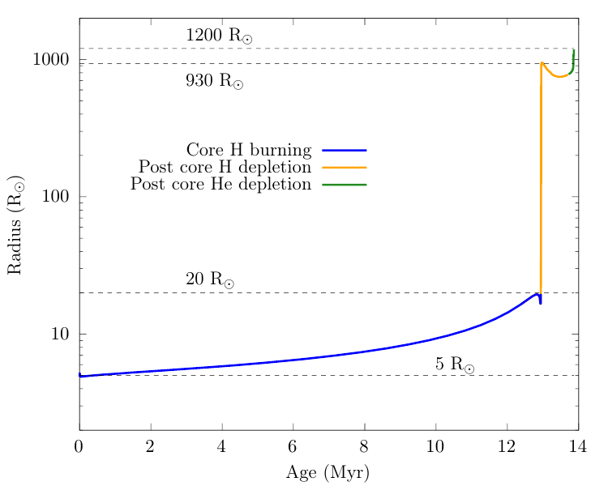

<script type="text/x-mathjax-config">MathJax.Hub.Config({tex2jax:{inlineMath:[['\$','\$'],['\\(','\\)']],processEscapes:true},CommonHTML: {matchFontHeight:false}});</script>
<script type="text/javascript" async src="https://cdnjs.cloudflare.com/ajax/libs/mathjax/2.7.1/MathJax.js?config=TeX-MML-AM_CHTML"></script>

Here is a downloadable copy of the desired [Lab1_binary](https://drive.google.com/file/d/1I6MnPMCoP70sHlNo4NWNYZYrRpX5UzUm/view?usp=share_link) MESA work directory.
This work directory is a slightly modified version of the `$MESA_DIR/binary/test_suite/evolve_both_stars` test_suite.

## Lab1 - Modeling a star through envelope stripping


Assume that we have a binary star system where the components are close enough to undergo Roche Lobe overflow (RLOF) from the inner L1 Lagrangian point. Additionally, assume that both components do not have the same mass so that the evolution of one star slightly lags the other star. In the lab, we would like to explore how the primary - more massive - star evolves in such a binary.

Since here we are primarily interested in the evolution of the primary, to save some computation time we are going to approximate the secondary as a point mass further. In other words, we are not going to model the evolution of the secondary. Then, later in Section~\ref{subsec: evolve both stars}, we will relax this assumption and evolve both stars in detail.

### The evolution of the primary star

Using the downloaded `Lab1_binary` directory,we will begin by modeling this system as a star + point mass. To do this, open `inlist_project` and make sure to set `evolve_both_stars = .false.`.

In the `&binary_controls`, you should see the following lines:

```
   m1 = 15d0  ! donor mass in Msun
   m2 = 12d0 ! companion mass in Msun
   initial_period_in_days = 6d0
```

A range of parameters to adjust the mass transfer efficiency are also available in `inlist_project`. Below is an example of a fully conservative mass transfer scheme where all the mass lost by the primary is assumed to be accreted onto the secondary.

```
   ! Mass transfer efficiency controls
   mass_transfer_alpha = 0d0      ! fraction of mass lost from the vicinity of donor as fast wind
   mass_transfer_beta = 0d0     ! fraction of mass lost from the vicinity of accretor as fast wind
   mass_transfer_delta = 0d0    ! fraction of mass lost from circumbinary coplanar toroid
   mass_transfer_gamma = 0d0    ! radius of the circumbinary coplanar toroid is ``gamma**2 * orbital_separation``
```

and here is an example of a nonconservative mass transfer model in which some fraction of the mass to be accreted onto the secondary is lost to winds. When we refer to the nonconservative mass transfer model, these are the controls we are referring to.

```
   ! Mass transfer efficiency controls
!   defaults are 0
   mass_transfer_alpha = 0d0      ! fraction of mass lost from the vicinity of donor as fast wind
   mass_transfer_beta = 0.6d0     ! fraction of mass lost from the vicinity of accretor as fast wind
   mass_transfer_delta = 0.1d0    ! fraction of mass lost from circumbinary coplanar toroid
   mass_transfer_gamma = 1.2d0    ! radius of the circumbinary coplanar toroid is ``gamma**2 * orbital_separation``
```

Now, let's explore the different types of mass transfer and the impact of nonconservative mass transfer on the evolution of our binary system.

For this lab we will keep the primary and companion/accretor mass fixed at **`m1 = 12d0`** and **`m2 = 12d0`**, do not adjust these masses. We will explore the effect of different mass ratios later on in Lab3. In this lab we will explore the binary evolution of our system with varying periods and and a fixed initial mass ratio *15/12* by modifying `initial_period_in_days`, and the impact of adopting nonconservative mass transfer by adopting different values for $\alpha, \beta, \delta, \gamma$. Each person at your table will run one of the following four models shown in the table below, and you will compare and discuss your results with one another.

| Primary (Donor) Mass ( $M_{\odot}$ ) | Period (days)| $\alpha$ | $\beta$ | $\delta$ | $\gamma$ |
|:------------------------||:--------------||:--------------|
| 15        | 4        | 0 | 0 | 0 | 0 |
| 15        | 15       | 0 | 0 | 0 | 0 |
| 15        | 200      | 0 | 0 | 0 | 0 | 
| 15        | 4        | 0 | 0.6 | 0.1 | 1.2 |

Now choose a value for the initial mass and period of the binary system from this table.


We want our binary evolution to terminate when the mass transfer phase is complete. All forms of mass transfer A, B, and C are typically complete by the time the primary has reached core-Helium depletion, as the timescale for stable mass transfer is significantly shorter than either the H or He burning lifetime.

In `inlist1`, set a stopping condition such that the model terminates when the primary reaches helium depletion. Let's terminate the model when $X$({$^4$He}) $\leq$ 1d-4:


```plaintext
      xa_central_lower_limit_species(1) = 'he4'
      xa_central_lower_limit(1) = 1d-4
```


Now, we will run the model. As before, for this, we need to execute the below commands in the terminal

```
./mk
./rn
```


The model should take roughly 7 minutes to run on a 4 core machine, you can use this time to inspect and discuss differences between your models and those of the others at your table. 

When your model is finished running, try to make a movie of your `&pgbianry` diagram so you can watch the movie instead of re-running your MESA model. In your `Lab1_binary` directory you can execute the `images_to_movie` command to convert your saved `&pgbinary` pngs into a movie. Here is an example that produces a .mp4 movie named `movie.mp4`.

```
images_to_movie "png/*.png" movie.mp4
```

Now that you have created a wonderful `&pgbinary` movie, let's use this movie in conjuction with our terminal output from our run to answer the following questions!

**CATCH UP:If you are having issues generating a pgstar movie, we have provided precomputed `&pgbinary` movies for all the runs [available for download here](https://drive.google.com/drive/u/2/folders/1gk5se7bKHbzZtfEEamj8Cr3iKzNCN7L9).**

| :question: Below are some questions to discuss at your table and answer while your model evolves | 
| :--- |
| 1. What type of mass transfer does your system undergo? Case A, B, C? |
| 2. Is the mass transfer in your system stable or unstable?|
| 3. What is the approximate mass of the primary when the mass transfer phase ends?|
| 4. What is the approximate mass of the secondary (accretor) when the mass transfer phase ends?|


## What kind of outcomes to expect


Mass transfer in binary systems are often classified based on which burning stage the donor star is in. This is because stars have very different structures depending on the burning stage and therefore respond to mass loss in completely different ways.

<dl>
  <dt> Case A mass transfer </dt>
       <dd> Mass transfer from a core hydrogen burning star (main sequence star).</dd>
  <dt> Case B mass transfer </dt>
       <dd> Mass transfer from a core hydrogen depleted star (post-main sequence star).  </dd>
  <dt> Case C mass transfer </dt>
       <dd> Mass transfer from a core helium depleted star. </dd>
</dl>

How do we know which type of mass transfer occurs? This can be done by simply comparing the size of the star during various burning stages to the size of its  Roche lobe.


The Roche lobe size can be estimated with the following formula

$$
\frac{R_\mathrm{rl}}{a} = \frac{0.49q^{2/3}}{0.6q^{2/3}+\ln{(1+q^{1/3})}}\equiv f(q)
$$

Here, $R_\mathrm{rl}$ is the volume equivalent Roche lobe radius of the donor, $a$ is the orbital semimajor axis and $q\equiv M_\mathrm{d}/M_\mathrm{a}$ is the mass ratio of the donor to accretor. Mass transfer occurs when the stellar radius exceeds the Roche lobe radius $R_\mathrm{d}>R_\mathrm{rl}$.

### Q. Calculate the orbital period ranges for Case A/B/C mass transfer for a 12+11$M_\odot$ binary. The radius evolution of our 12$M_\odot$ star looks like this:



<details><summary>Answers</summary>

If the donor star engages in mass transfer at a given radius $R$, the orbital separation needs to be $a=R/f(q)$. The orbital period of a binary is given by Kepler's law
$$
P_\mathrm{orb}=2\pi\sqrt{\frac{a^3}{G(M_1+M_2)}}.
$$

<dl>
 <dd>Case A: $0.9~\mathrm{d}\lesssim P_\mathrm{orb}\lesssim6.4~\mathrm{d}$</dd>
 <dd>Case B: $6.4~\mathrm{d}\lesssim P_\mathrm{orb}\lesssim1860~\mathrm{d}$</dd>
 <dd>Case C: $1860~\mathrm{d}\lesssim P_\mathrm{orb}\lesssim2720~\mathrm{d}$</dd>
</dl>

Discussion point: What are the ratios of Case A vs Case B vs Case C mass transfer if we assume a log-uniform orbital period distribution?

</details>


### Bonus exercise - Nonconservative mass transfer (Over lunch if necessary)


