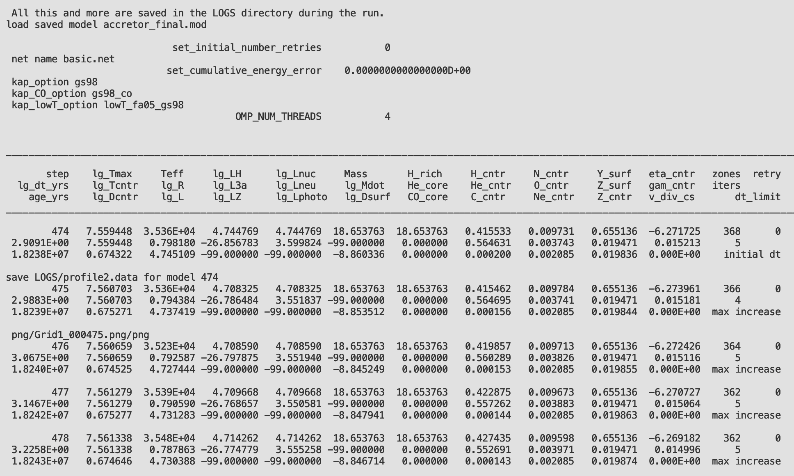

## Lab2 -  Modeling The Mass Gainer

### Science goal

In Minilab1, we explored the evolution of a stellar binary, with a particular focus on the mass donor (a.k.a the primary - initially more massive star). In this lab, we now turn our attention towards the other component in the binary, i.e., the mass gainer (a.k.a. the secondary - initially less massive star). The aim is to explore how binary interaction changes the appearance, structure, and future evolution of the mass gainer. We will mainly discuss how mass accretion could impact the surface composition and internal structure of the accretor star. This accreted mass should also carry a substantial amount of angular momentum, which could also impact the star's properties (e.g., see \cite{renzo2021evolution} for more information). In the main lab, we will mostly ignore the impact of the angular momentum carried by the accreted material on the mass gainer. % and leave this as a bonus exercise. 


#### Bonus goal

As a homework exercise, you may also like to study the evolution of the binary once the primary turns into a compact object, which we assume to be a black hole. In such a case, the secondary could subsequently expand and dump its matter onto the black hole. This inflences the properties of the black hole, like its mass and spin. In the bonus exercise, we will explore how these properties evolve as a function of the mass accretion rate.


### Evolving the mass gainer as a single star
For computational ease, we will load the _saved accretor model_ from the last (Minilab1) run and then evolve this model _as a single star_. To begin, first copy the necessary files required for Minilab2 from the following link.

   [Click here to access Minilab2](https://drive.google.com/file/d/1kuKGSnNPDEjx45ahGyltGhIJtdvJF_jC/view?usp=share_link)


Now go to the directory of Minilab1, and from there, copy the file named `accretor_final.mod` into the Minilab2 directory. This file contains the accretor's information from the previous run and will act as _an initial condition for the present run_. If your Minilab1 and Minilab2 are in the same base directory, then you could run the following command from the base directory in the terminal to perform the copy operation

```
   $ cp -r ./Minilab1/accretor\_final.mod ./Minilab2
```

 If, for some reason, you were not able to finish, then do not worry; we have already provided a pre-evolved copy of the accretor model in the Minilab2 directory with the name `accretor_final_1.mod`. If you want to use this model, rename the file to `accretor_final.mod` to match the name included within `inlist_accretor`.

**Q.**
   Can you tell where in `inlist_accretor`is the pre-evolved accretor model being loaded?


## Evolution of the mass gainer

Now, let us continue the evolution of the accretor star from where we left it in Minilab1. For this, you will need to execute the below commands in your terminal (given that you are already present in the Minilab2 directory)
```
    $ ./mk 
    $ ./rn
```

If all went as planned, then you should see a terminal window that should be similar to the one shown below.
 

*An example of the terminal output for Minilab2*

 
Additionally, you should see a `pgstar` plot (similar to the screen below) popping up on your screen that shows the real-time evolution of the star. What output is shown on this plot depends on the user's requirement and can be modified at will. These modifications can be performed by modifying the file `inlist_pgstar`


    *A sample plot showing a snapshot of the evolution of the accretor star.*


<div class="markdown-alert markdown-alert-tip"><p class="markdown-alert-title"><svg class="octicon octicon-light-bulb mr-2" viewBox="0 0 16 16" version="1.1" width="16" height="16" aria-hidden="true"><path d="M8 1.5c-2.363 0-4 1.69-4 3.75 0 .984.424 1.625.984 2.304l.214.253c.223.264.47.556.673.848.284.411.537.896.621 1.49a.75.75 0 0 1-1.484.211c-.04-.282-.163-.547-.37-.847a8.456 8.456 0 0 0-.542-.68c-.084-.1-.173-.205-.268-.32C3.201 7.75 2.5 6.766 2.5 5.25 2.5 2.31 4.863 0 8 0s5.5 2.31 5.5 5.25c0 1.516-.701 2.5-1.328 3.259-.095.115-.184.22-.268.319-.207.245-.383.453-.541.681-.208.3-.33.565-.37.847a.751.751 0 0 1-1.485-.212c.084-.593.337-1.078.621-1.489.203-.292.45-.584.673-.848.075-.088.147-.173.213-.253.561-.679.985-1.32.985-2.304 0-2.06-1.637-3.75-4-3.75ZM5.75 12h4.5a.75.75 0 0 1 0 1.5h-4.5a.75.75 0 0 1 0-1.5ZM6 15.25a.75.75 0 0 1 .75-.75h2.5a.75.75 0 0 1 0 1.5h-2.5a.75.75 0 0 1-.75-.75Z"></path></svg>
Tip</p>
<p>While the model evolves: Carefully watch the evolution of the accretor star (especially the `Abundance-Power-Mixing` subplot and the Kippenhahn diagram. We will later compare this model to that of a single star to explore key differences between the two.</p>
</div>


## Single star versus binary star directory

Before we proceed further, it would be worthwhile to explore the primary differences between the contents of the previous lab directory and this lab. In the last lab, we evolved both stars. As such, we had two `inlists` (one each for the primary and the secondary star). These inlists contained the parameters that were relevant for each star. In addition, there was an inlist called `inlist_project`, which contained the binary parameters, e.g., the period of the binary and the initial mass of each star in the binary, etc.  Meanwhile, the files contained in the directory of Minilab2 are shown below.


*The contents of the `evolve_accretor_star` directory*


As mentioned earlier, to see the above files in your terminal, you need to run the `tree` command. You will notice that here, we only have one main inlist named `inlist_accretor`, which contains the parameters we need to set for evolving the accretor star. Although we would stress that this is not necessary, and you are free to break this one inlist into many sub-inlists. As an example, see the files located in the directory `\$MESA_DIR/star/test_suite/ccsn_IIp` \,. Additionally, you will see that the `src` directory for the accretor star (i.e., evolved as a single star) no longer contains the `run_binary_extras.f90` file - as we are not evolving a binary model anymore.


## Making a movie from the `pgstar` output

The `pgstar` output shows the evolution of the star in real time. But what if we would like to see the evolution of the model at a later time? The `pgstar` output is also saved in the `Minilab2_png` directory. Perhaps the best way to access the information contained in these `png` files is to make a movie out of them. The MESA SDK includes an ffmpeg encoder and a script named `images_to_movie.sh` that allows users to create movies from `png` files. To do this, execute the following command in your terminal from within the Minilab2 directory
```
  $ images_to_movie 'png/*.png' movie_accretor_star.mp4
```
This will create a movie out of the `png` files and save it with the name `movie_accretor_star.mp4`.


## Does the accretor evolve differently than a single star with same initial mass?


Although we have evolved the accretor as a single star, it would be instructive to check how this differs from the evolution of a single star that never interacted with a companion. 
Intuitively, we know that the accretor star gained mass through Roche Lobe overflow and that this mass had a somewhat different chemical composition than the accretor star's surface. This is because the primary already has substantial helium on its surface during the later stage of mass transfer.


In this section, the goal would be to evolve a single star with the same initial mass as the accretor star (i.e., the mass of the accretor post mass transfer). Then, we will compare the structure and evolution of the accretor with that of a single star.
To begin, download the necessary files required to evolve a single star from the below link

   [Click here to access the single star model for Minilab2](https://drive.google.com/file/d/1kuKGSnNPDEjx45ahGyltGhIJtdvJF_jC/view?usp=share_link)

 This directory has the same structure as the previously used directory in Minilab2. However, the names of the `inlists` have been modified to show that we are now evolving a single star explicitly. Apart from some minor changes - that you can see by comparing the `inlist_accretor` to `inlist_single_star` - the rest of the directory is the same. 


<div class="markdown-alert markdown-alert-note"><p class="markdown-alert-title"><svg class="octicon octicon-info mr-2" viewBox="0 0 16 16" version="1.1" width="16" height="16" aria-hidden="true"><path d="M0 8a8 8 0 1 1 16 0A8 8 0 0 1 0 8Zm8-6.5a6.5 6.5 0 1 0 0 13 6.5 6.5 0 0 0 0-13ZM6.5 7.75A.75.75 0 0 1 7.25 7h1a.75.75 0 0 1 .75.75v2.75h.25a.75.75 0 0 1 0 1.5h-2a.75.75 0 0 1 0-1.5h.25v-2h-.25a.75.75 0 0 1-.75-.75ZM8 6a1 1 0 1 1 0-2 1 1 0 0 1 0 2Z"></path></svg>Question</p><p>What is the mass of the accretor at the end of the mass transfer phase (or when the model is terminated) in Minilab1?</p>
</div>


 To evolve the single star, first, you will need to set the mass of the single star equal to the mass of the accretor star. In the downloaded directory, this has already been done.
 
To run the model, you will need to execute the below commands in your terminal (given that you are already present in the right directory)
 
```
   $ ./mk
   $ ./rn
```

 Like the last run, you should again see similar activity on your monitor. For example, we show below a snapshot of the star's evolution plotted using `pgstar`. 


   *A snapshot of the single star's evolution.*


<div class="markdown-alert markdown-alert-note"><p class="markdown-alert-title"><svg class="octicon octicon-info mr-2" viewBox="0 0 16 16" version="1.1" width="16" height="16" aria-hidden="true"><path d="M0 8a8 8 0 1 1 16 0A8 8 0 0 1 0 8Zm8-6.5a6.5 6.5 0 1 0 0 13 6.5 6.5 0 0 0 0-13ZM6.5 7.75A.75.75 0 0 1 7.25 7h1a.75.75 0 0 1 .75.75v2.75h.25a.75.75 0 0 1 0 1.5h-2a.75.75 0 0 1 0-1.5h.25v-2h-.25a.75.75 0 0 1-.75-.75ZM8 6a1 1 0 1 1 0-2 1 1 0 0 1 0 2Z"></path></svg>
 Question </p>
<p>What difference do you notice between the accretor's evolution versus that of a single star?</p>
</div>

<div class="markdown-alert markdown-alert-tip"><p class="markdown-alert-title"><svg class="octicon octicon-light-bulb mr-2" viewBox="0 0 16 16" version="1.1" width="16" height="16" aria-hidden="true"><path d="M8 1.5c-2.363 0-4 1.69-4 3.75 0 .984.424 1.625.984 2.304l.214.253c.223.264.47.556.673.848.284.411.537.896.621 1.49a.75.75 0 0 1-1.484.211c-.04-.282-.163-.547-.37-.847a8.456 8.456 0 0 0-.542-.68c-.084-.1-.173-.205-.268-.32C3.201 7.75 2.5 6.766 2.5 5.25 2.5 2.31 4.863 0 8 0s5.5 2.31 5.5 5.25c0 1.516-.701 2.5-1.328 3.259-.095.115-.184.22-.268.319-.207.245-.383.453-.541.681-.208.3-.33.565-.37.847a.751.751 0 0 1-1.485-.212c.084-.593.337-1.078.621-1.489.203-.292.45-.584.673-.848.075-.088.147-.173.213-.253.561-.679.985-1.32.985-2.304 0-2.06-1.637-3.75-4-3.75ZM5.75 12h4.5a.75.75 0 0 1 0 1.5h-4.5a.75.75 0 0 1 0-1.5ZM6 15.25a.75.75 0 0 1 .75-.75h2.5a.75.75 0 0 1 0 1.5h-2.5a.75.75 0 0 1-.75-.75Z"></path></svg>
Hint</p>
<p>Perhaps the easiest way is to first make a movie of the output for both the stars using the previously explained method. Once you have the movie for both the stars, run them side by side and compare. In case you were not able to make a movie, then you can access made movies by clicking on this [link](some_link.html).</p>
</div>


<details><summary>Answer</summary>
\comment{Jan do you have a preferred answer here apart from the surface composition and the internal composition plus the Kippenhahn diagram?}
</details>

