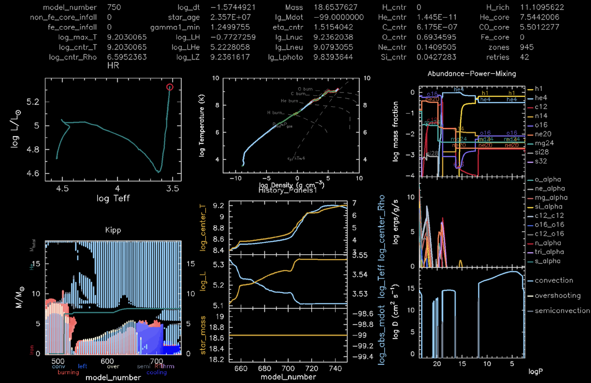
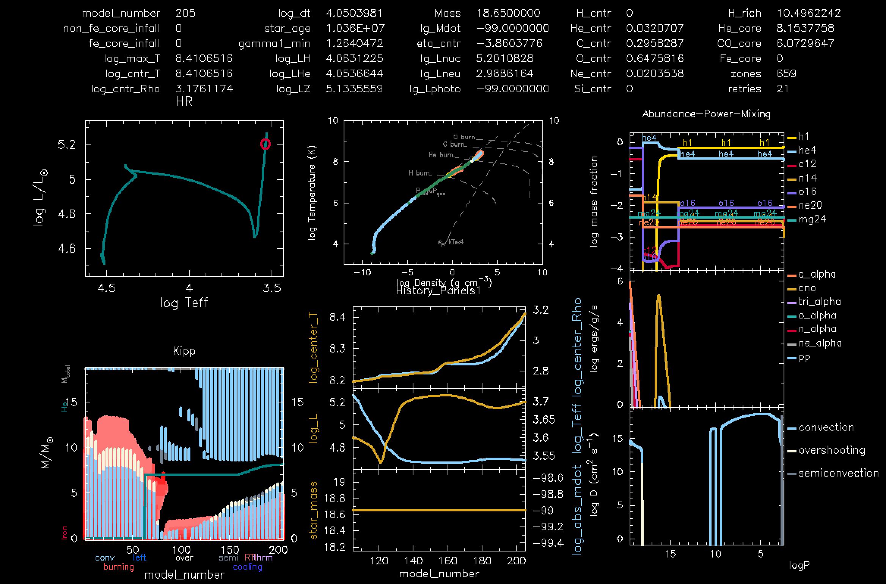
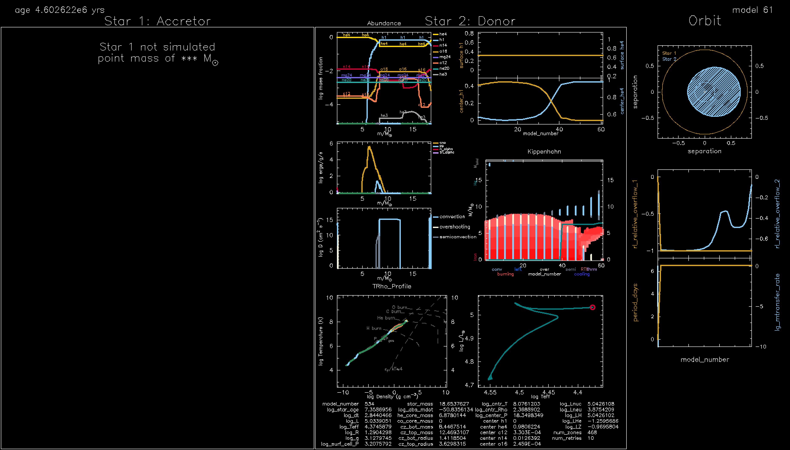

<script type="text/x-mathjax-config">MathJax.Hub.Config({tex2jax:{inlineMath:[['\$','\$'],['\\(','\\)']],processEscapes:true},CommonHTML: {matchFontHeight:false}});</script>
<script type="text/javascript" async src="https://cdnjs.cloudflare.com/ajax/libs/mathjax/2.7.1/MathJax.js?config=TeX-MML-AM_CHTML"></script>

|:exclamation: TEMPORARY|
|:--|
|The content of Lab 2 has been ported over from [this PDF version](MESA_Lab2.pdf). See PDF in case you find anything is missing from the website.|

# Lab3 -  Modeling The Mass Gainer

## Science goal

In Minilab1, we explored the evolution of a stellar binary, with a particular focus on the mass donor (a.k.a the primary - initially more massive star). In this lab, we now turn our attention towards the other component in the binary, i.e., the mass gainer (a.k.a. the secondary - initially less massive star). The aim is to explore how binary interaction changes the appearance, structure (both surface and internal), and future evolution of the mass gainer. This accreted mass should also carry a substantial amount of angular momentum, which could also impact the star's properties (e.g., see Renzo et al. 2021 for more information). In this lab, we will ignore the impact of the angular momentum carried by the accreted material on the mass gainer. 


### Bonus goal

As a homework exercise, you may also like to study the evolution of the binary once the primary turns into a compact object, which we assume to be a black hole. In such a case, the secondary could subsequently expand and dump its matter onto the black hole. This inflences the properties of the black hole, like its mass and spin. In the bonus exercise, we will explore how these properties evolve as a function of the mass accretion rate.


## Evolving the mass gainer as a single star
For computational ease, we will load the _saved accretor model_ from the last (Minilab1) run and then evolve this model _as a single star_. To begin, first copy the necessary files required for Minilab2 from the following link.

   [Click here to access Minilab2](https://drive.google.com/drive/folders/1-ypOXDdakm_PsCxDUS6niXmAFkWx2zEm?usp=drive_link)

You will have to download Minilab2 and extract the contents of the `evolve_accretor_star.zip` directory.
Now go to the directory of Minilab1, and from there, copy the file named `accretor_final.mod` into the Minilab2 directory. This file contains the accretor's information from the previous run and will act as _an initial condition for the present run_. If your Minilab1 and Minilab2 are in the same base directory, then you could run the following command from the base directory in the terminal to perform the copy operation

```shell-session
$ cp -r ./Minilab1/accretor_final.mod ./Minilab2/Evolve_accretor_star
```

 If, for some reason, you were not able to finish, then do not worry; we have already provided a pre-evolved copy of the accretor model in the Minilab2 directory with the name `accretor_final_1.mod`. If you want to use this model, rename the file to `accretor_final.mod` to match the name included within `inlist_accretor`.

 
| :question: QUESTION | 
| :--- |
| Can you tell where in `inlist_accretor` is the pre-evolved accretor model being loaded? |

### Evolution of the mass gainer

Now, let us continue the evolution of the accretor star from where we left it in Minilab1. For this, you will need to execute the below commands in your terminal (given that you are already present in the `Evolve_accretor_star` directory)

```shell-session
$ ./mk 
$ ./rn
```

If all went as planned, then you should see a terminal window that should be similar to the one shown below.
 

   *<br>An example of the terminal output for Minilab2*

 
Additionally, you should see a `pgstar` plot (similar to the screen below) popping up on your screen that shows the real-time evolution of the star. What output is shown on this plot depends on the user's requirement and can be modified at will. These modifications can be performed by modifying the file `inlist_pgstar`


   *<br>A sample plot showing a snapshot of the evolution of the accretor star.*


| :eyes: IMPORTANT |
|:--|
|While the model evolves: Carefully watch the evolution of the accretor star (especially the `Abundance-Power-Mixing` subplot and the Kippenhahn diagram. We will later compare this model to that of a single star to explore key differences between the two.|

#### Abundance-Power-Mixing plot
As the name suggests, the top subplot in the plot shows the abundance of various chemical species within the star. The middle subplot shows the regions where nuclear fusion is taking place. It also shows what element is being fused in these regions. The bottom subplot shows the various types of diffusive mixing processes taking place within the star.

#### Kippenhahn plot
This diagram is used to visualize the internal structure and evolution of a star. It displays information such as convective borders, sites of nuclear energy generation, and sites of shell burning. The cyan regions indicate convective areas, and the red regions indicate the regions where nuclear burning is taking place. The white regions show the convective regions where overshooting is taking place, and the grey regions indicate semi-convection. The latter occurs in regions where neither pure convection nor pure radiation is efficient enough to transport energy effectively. The cooling (blue) region refers to a region where the temperature is decreasing over time. The grey line shows the total mass boundary of the star $M_{\rm total}$, while the green line shows the mass boundary of the helium core $M_{\rm He}$. 

### Single star versus binary star directory

Before we proceed further, it would be worthwhile to explore the primary differences between the contents of the previous lab directory and this lab. In the last lab, we evolved both stars. As such, we had two `inlists` (one each for the primary and the secondary star). These inlists contained the parameters that were relevant for each star. In addition, there was an inlist called `inlist_project`, which contained the binary parameters, e.g., the period of the binary and the initial mass of each star in the binary, etc.  Meanwhile, the files contained in the directory of Minilab2 are shown below.


   *<br>The contents of the `evolve_accretor_star` directory*


As mentioned earlier, to see the above files in your terminal, you need to run the `tree` command. You will notice that here, we only have one main inlist named `inlist_accretor`, which contains the parameters we need to set for evolving the accretor star. Although we would stress that this is not necessary, and you are free to break this one inlist into many sub-inlists. As an example, see the files located in the directory `$MESA_DIR/star/test_suite/ccsn_IIp`. Additionally, you will see that the `src` directory for the accretor star (i.e., evolved as a single star) no longer contains the `run_binary_extras.f90` file - as we are not evolving a binary model anymore.


### Making a movie from the `pgstar` output

The `pgstar` output shows the evolution of the star in real time. But what if we would like to see the evolution of the model at a later time? The `pgstar` output is also saved in the `Minilab2_png` directory. Perhaps the best way to access the information contained in these `png` files is to make a movie out of them. The MESA SDK includes an ffmpeg encoder and a script named `images_to_movie.sh` that allows users to create movies from `png` files. To do this, execute the following command in your terminal from within the Minilab2 directory
```shell-session
$ images_to_movie 'png/*.png' movie_accretor_star.mp4
```
This will create a movie out of the `png` files and save it with the name `movie_accretor_star.mp4`.


## Does the accretor evolve differently than a single star with same initial mass?


Although we have evolved the accretor as a single star, it would be instructive to check how this differs from the evolution of a single star that never interacted with a companion. 
Intuitively, we know that the accretor star gained mass through Roche Lobe overflow and that this material had a somewhat different chemical composition than the accretor star's surface. This is because the primary already has substantial helium on its surface during the later stage of mass transfer.


In this section, the goal would be to evolve a single star with the same initial mass as the accretor star (i.e., the mass of the accretor post mass transfer). Then, we will compare the structure and evolution of the accretor with that of a single star.
To begin, download the necessary files required to evolve a single star from the below link

   [Click here to access the single star model for Minilab2](https://drive.google.com/drive/folders/1-ypOXDdakm_PsCxDUS6niXmAFkWx2zEm)

Download the `evolve_single_star` directory, extract its content in the Minilab2 directory. You will notice that this directory has the same structure as the `Evolve_accretor_star` directory in Minilab2. However, the names of the `inlists` have been modified to show that we are now evolving a single star explicitly. Apart from some minor changes - that you can see by comparing the `inlist_accretor` to `inlist_single_star` - the rest of the directory is the same. 


|:question: QUESTION |
|:--|
| What is the mass of the accretor at the end of the mass transfer phase (or when the model is terminated) in Minilab1?|


 To evolve the single star, first, you will need to set the mass of the single star equal to the mass of the accretor star. 
 
To run the model, you will need to execute the below commands in your terminal (given that you are already present in the right directory)
 
```shell-session
$ ./mk
$ ./rn
```

 Like the last run, you should again see similar activity on your monitor. For example, we show below a snapshot of the star's evolution plotted using `pgstar`. 


   *<br>A snapshot of the single star's evolution.*


|:question: QUESTION|
|:--|
|What difference do you notice between the accretor's evolution versus that of a single star?|


|:information_source: HINT|
|:--|
|Perhaps the easiest way is to first make a movie of the output for both the stars using the previously explained method. Once you have the movie for both the stars, run them side by side and compare. |


<details markdown="block"><summary>Answer: Pre-computed movie</summary>

In case you were not able to make a movie, then you can access made movies by clicking on this [Minilab2 directory](https://drive.google.com/drive/folders/1-ypOXDdakm_PsCxDUS6niXmAFkWx2zEm). During the initial stages, you should be able to see that the accretor has a much larger helium abundance on its surface compared to the single star. Over time, this composition evolves, and in the end, both stars have similar surface compositions.  There is also a considerable difference between the internal evolution of the two stars, as seen in the Kippenhahn diagram. During the initial phase, the burning zones of the single star extend to larger mass coordinates than that of the accretor. 

</details>


## Lab extension - Evolving the secondary alongside a black hole

Although to save computation we approximated the accretor's evolution as if it was an isolated star, ideally, we would like to evolve the star in a binary system. 

This section is devoted to that.


While initially, there would not be much difference in the evolution, once the accretor begins to expand, it might fill its Roche Lobe and initiate a phase of mass transfer on what was earlier a primary star. This will strip the secondary of its surface material and expose its inner core. Moreover, the primary star would have long disappeared and only a compact remnant would be left behind. As such, we will approximate the primary star as a point mass, i.e. only the gravitational influence of the primary would be important to us. The primary star - which is now modelled as a black hole - would feed on the mass dumped by the secondary and *would act as a source of strong X-ray radiation*.


### The black hole's evolution

The accreted mass would cause the properties of the black hole to change. The no-hair theorems suggest that the only relevant parameters of an astrophysical black hole that fully determine its property are its mass $M$ and angular momentum $J$. 
So our task is to see how $M$ and $J$ evolve with time. 
Using $M, J$ we can define another parameter called the *dimensionless Kerr spin parameter* of the black hole as 
$$
    a = \frac{Jc}{GM^2}
$$
where $c, G$ is the speed of light and Newton's gravitational constant, respectively. The usefulness of this parameter is evident from the fact that for astrophysical black holes $a \in [0, 1)$ (e.g., Thorne 1974). A value of $a \geq 1$ implies the violation of the *cosmic censorship principle* (Penrose 1969).


Let us assume that the infalling matter has sufficient AM to at least circularise outside the (innermost stable circular orbit) ISCO of the black hole from where it is directly accreted. Then the change in $J$ of the mass accreting black hole is $dJ/dm = j_{\rm isco}$ where $dm$ is the rest mass of the matter being accreted.
Similarly, the change in $M$ is $dM/dm = E_{\rm isco}/c^2$, where $E_{\rm isco}$ is the specific energy of a particle at ISCO. The evolution of the spin parameter due to accretion can be obtained by differentiating the above equation w.r.t. $m$, resulting in
$$
    \frac{d a}{d \ln m}=\frac{c}{r_{\mathrm{g}}} \frac{j_{\mathrm{isco}}}{E_{\mathrm{isco}}}-2 a .
$$
One can then solve this for $a$. For an initially non rotating black hole with mass $M_{0}$ and final mass $M$ this solution can be found by integrating the above and is given by (Bardeen_1970, Thorne_1974)
$$
    a = \begin{cases}\sqrt{\frac{2}{3}} \frac{M_0}{M}\left[4-\sqrt{18 \frac{M_0^2}{M^2}-2}\right] & \text { if } M \leq \sqrt{6} M_0 \,,\\ 1 & \text { if } M>\sqrt{6} M_0 \,.\end{cases} 
$$


### Task

To set the evolved primary as a point mass source, we will reuse Minilab1. *Here are the steps* that you would need to follow before we can evolve the binary:


1. Make a fresh copy of Minilab1 bonus exercise (you should have left it running during the break).
1. Open the `inlist_project` and include the following commands in the `&binary_job` region
    ```
       change_initial_point_mass_i = .true.
       new_point_mass_i = 1
    ```
Above the index "1" refers to the primary star. These lines set the primary star to a point mass.
1. We will have to make a minor addition to the `run_binary_extras.f90` file. Op    en this file which is located in the `src` directory. Scroll to the end of the file, where you will find the function named `extras_binary_startup`. After the line `call test_suite_startup(b, restart, ierr)` in the function, include the following line
    ```
       b% eq_initial_bh_mass = b% m(1)
    ```
    This lets the code know the birth mass of the point object. 
1. Next, we will need to specify the period of the binary at the moment when we set the primary to a point mass. 

   |:question: QUESTION|
   |:--|
   |Can you find the mass and period of the binary as they were at the end of Minilab1?|
   
    Take the above value for the period (say 6 days( and set it accordingly in the `inist_project` as shown below
    ```
       initial_period_in_days = 6d0  ! Period of the binary at the end of Minilab1
    ```
1. As our goal is to evolve the spin of the black hole, we would like to save this spin evolution into the history file. To do this go to the `run_binary_extras.f90` file and there in the function `how_many_extra_binary_history_columns` replace the `how_many_extra_binary_history_columns = 0` line with `how_many_extra_binary_history_columns = 1`. This tells the code that we would like to have an extra history column.

1. Next, we will have to tell the code what data we want to write in this column. For this go to the `data_for_extra_binary_history_columns` function in the same file. At the end of the function include the following 
    ```fortran    
       names(1) = 'abh'
       ! Set the spin of the black hole at the beginning of mass transfer to zero
       if (b% eq_initial_bh_mass ==  b% m(1)) then
          vals(1) = 0
       endif
    ```
    Here `names(1) = 'abh'` is the name of the extra column that will be saved in the `binary_history.data` file and `val(1)` contains the data of the same column, i.e., the value of the spin of the black hole `abh`. As you can see, we till the black hole does not accrete any mass, we set this to zero.

1. Once the black hole begins to accrete mass, its spin will increase. To evolve the spin of the black hole (in accordance with the discussion earlier), add the following lines underneath the previous addition. After this, you are all set.
    ```fortran
       call  calc_black_hole_spin(b% eq_initial_bh_mass, b% m(1), vals(1))
      
       contains
       
       ! include the below file in you Minilab2 directory. It contains one more function
       include '../black_hole_spin.f90'
    ```

    If you are curious about the contents of the `black_hole_spin.f90` file then they should look like this
    ```fortran
    subroutine calc_black_hole_spin(Mbh_in, Mbh, abh)  
     
         real(dp) :: Mbh_in, Mbh, abh, dt, c, G
    
         ! Define constants
         c = 2.99792d10  !speed of light (cgs)
         G = 6.674d-8     !Newton's constant (cgs)
    
         ! Note
         !Mbh_in is the initial mass of the black hole 
         !Mbh is its current mass
         !abh is its current Kerr spin parameter
             
         ! Calculating abh evoltuion 
         abh = sqrt(2.0/3.0) * (Mbh_in / Mbh) * (4.0 - sqrt(18.0 * (Mbh_in**2) / (Mbh**2) - 2.0))
         if (abh > 0.994) abh = 0.9994 ! Max spin that we allow here
             
    end subroutine calc_black_hole_spin
    ```


Compile the above code and run it. You will see something like the figure below in the `pgstar` output. While the model runs you can see that the file `binary_history.data`  file should start population the column named `abh` with the black hole spin data. At the end of the run, you can also plot this spin evolution as a function of time to see how it evolved.

|:information_source: NOTE|
|:--|
|If for some reason the model fails to evolve due to convergence issue, then instead of steps 2. and 3. you may want to set instead the flag `evolve_both_stars = .false.` which would make the secondary into a point mass (and omit step 2 and 3). If you do this, then you would accordingly have to set all `m(1)` to `m(2)` in steps 5 and 7.|



*A snapshot of the accretor star being evolved next to a point mass.*


