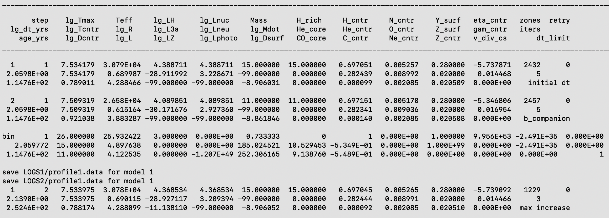
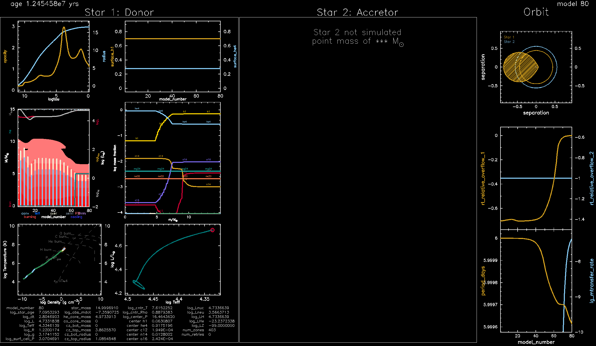

credit: ESO/L. Calçada

# Introduction

[HELP LINK for website building](./help.html)

[Google drive link to download Thursday Lab Materials](https://drive.google.com/drive/folders/1yFy2I7kBh6UZPYmhFxkZswQVPI0Qavjc?usp=share_link)

[Link to Lab Solutions](https://drive.google.com/drive/folders/11WEpwn17_XuxKugH0B57OHMjby-jomUj?usp=share_link)


To begin, please download a copy of the desired [Lab1_binary](https://drive.google.com/file/d/1I6MnPMCoP70sHlNo4NWNYZYrRpX5UzUm/view?usp=share_link) MESA work directory.
This work directory is a slightly modified version of the `$MESA_DIR/binary/test_suite/evolve_both_stars` test_suite.

To get an idea of what is inside `Lab1_binary` we can use the `tree` command.

The `tree` command shows the files contained in the `Lab1_binary` directory and its subdirectories.

If your terminal does not have `tree` installed, you  can do it by executing

```shell-session
$ brew install tree (on mac)
```
or
```shell-session
$ sudo apt-get install tree (on linux)
```
It's alright if you don't have `tree` or cannot download it, `ls` should suffice.

`tree ./Lab1_binary` should return the following.

```shell-session
├── clean
├── inlist
├── inlist1
├── inlist2
├── inlist_pgbinary
├── inlist_pgstar
├── inlist_project
├── make
│   └── makefile
├── mk
├── history_columns.list
├── profile_columns.list
├── re
├── rn
└── src
    ├── binary_run.f90
    ├── run_binary_extras.f90
    └── run_star_extras.f90

3 directories, 16 files
```


All files are briefly described in the table below

### MESA BINARY work directory

| Filename                | Description       |
|:------------------------|:------------------|
| `clean`                 | A bash file for cleaning the model directory.       |
| `inlist`                | The header inlist which points to all other inlists to determine which inlists are read and in what order. |
| `inlist1`               | The main inlist which contains controls for the stellar evolution of the `m1`  |
| `inlist2`               | The main inlist which contains controls for the stellar evolution of the `m2`     |
| `inlist_pgbinary`       | The inlist which controls the pgstar output for the binary evolution.      |
| `inlist_pgstar`         | The inlist which controls the pgstar output for each single star.      |
| `inlist_project`        | The main inlist which contains controls for the evolution of the binary |
| `make/`                  | A directory containing the makefile.   |
| `mk`                    | A bash file for compiling MESA binary and Star in the model directory.      |
| `history_columns.list`  | A log file which determines which history values are saved in data files as a function of model timestep. |
| `profile_columns.list`       | A log file which determines which profiles values are saved in data files as a function of Mass/radius.     |
| `re`                    | A bash file for restarting the binary/star model executable from photos      |
| `rn`                    | A bash file for running the binary/star model executable.      |
| `src/`                   | A directory containing the three files listed below.      |
| `binary_run.f90`        | A fortran file for running the binary model.      |
| `run_binary_extras.f90` | A fortran file which can be modified to agument the binary evolution routines.      |
| `run_star_extras.f90`   | A fortran file which can be modified to agument the stellar evolution routines.     |

`inlist_project`, `inlist1`, and `inlist2` are the three main files that contain the microphysics information of our binary stellar evolution simulation.

## Setting the stellar parameters

### Binary parameters

The `inlist_project` - which is relevant for binary parameters -  will look something like this

```plaintext
&binary_job

   inlist_names(1) = 'inlist1'
   inlist_names(2) = 'inlist2'

   evolve_both_stars = .true.

/ ! end of binary_job namelist

&binary_controls

   m1 = 15d0  ! donor mass in Msun
   m2 = 12d0 ! companion mass in Msun
   initial_period_in_days = 6d0

/ ! end of binary_controls namelist
```

and will allow us to set the binary parameters, e.g., the initial mass of the stars and their orbital period. The full list of available parameter for `&binary_job` can be found in the directory

```
$MESA_DIR/binary/defaults/binary_job.defaults
```

and those of `&binary_controls` can be found in

```
$MESA_DIR/binary/defaults/binary_controls.defaults
```

If you would like to change any of these default values, just copy them to `inlist_project` and set the new values there.

### Parameters of the component stars

Any (non-default) values for the parameters of the individual stars will be set in the `inlist1` (for primary star) and `inlist2` (for secondary star) files. The more massive star is considered as the primary star and dictates the initial evolution of the binary system. An example of the contents in `inlist1` is

```plaintext
&star_job

      show_log_description_at_start = .false.
      save_model_when_terminate = .true.
      save_model_filename = 'donar_final.mod'

/ ! end of star_job namelist

&eos

/ ! end of eos namelist

&kap
Zbase = 0.02

/ ! end of kap namelist


&controls
       max_model_number = 3500

      ! convection 
      use_ledoux_criterion = .true.
      alpha_semiconvection = 1d0
      
      ! reduce resolution and solver tolerance to make runs faster
      mesh_delta_coeff = 2.5d0
      time_delta_coeff = 2.5d0
      varcontrol_target = 1d-3
      use_gold2_tolerances = .true.
      use_gold_tolerances = .true.

      ! stopping condition
      xa_central_lower_limit_species(1) = 'he4'
      xa_central_lower_limit(1) = 1d-4


      ! help the envelope carry energy to 
      ! the surface for solar metallicity
      use_superad_reduction = .true.
      superad_reduction_Gamma_limit = 0.5d0
      superad_reduction_Gamma_limit_scale = 5d0
      superad_reduction_Gamma_inv_scale = 5d0
      superad_reduction_diff_grads_limit = 1d-2
      superad_reduction_limit = -1d0

      ! we use step overshooting
      overshoot_scheme(1) = 'step'
      overshoot_zone_type(1) = 'burn_H'
      overshoot_zone_loc(1) = 'core'
      overshoot_bdy_loc(1) = 'top'
      overshoot_f(1) = 0.345
      overshoot_f0(1) = 0.01

      ! a bit of exponential overshooting for convective core during He burn
      overshoot_scheme(2) = 'exponential'
      overshoot_zone_type(2) = 'burn_He'
      overshoot_zone_loc(2) = 'core'
      overshoot_bdy_loc(2) = 'top'
      overshoot_f(2) = 0.01
      overshoot_f0(2) = 0.005

      !output
      extra_terminal_output_file = 'log1' 
      log_directory = 'LOGS1'

      ! output frequency section:
       photo_interval         = 50
       photo_digits           = 6
       profile_interval       = 200 ! 
       max_num_profile_models = 400000
       history_interval       = 1
       terminal_interval      = 10
       write_header_frequency = 10

/ ! end of controls namelist


&pgstar
   read_extra_pgstar_inlist(1) = .true.
   extra_pgstar_inlist_name(1)= 'inlist_pgstar'

/ ! end of pgstar namelist

```

Many other (default) parameters which are not modified in the above inlist can be found in the directory

```
$MESA_DIR/star/defaults/
```

As before copy the relevant parameter you wish to change to `inlist1` before making the change. Similarly, `inlist2` contains the parameters of star 2.

### Setting values for an initial run

Here, we will run our first model. For this, we need to set the masses of the stars in the binary and the binary's orbit period. Choose a desired value and then execute the below commands in your terminal

```shell-session
$ ./mk
$ ./rn
```

### Terminal Output

On executing the above commands, MESA will print the model output on the terminal. After each step the new updated values of the binaries parameters would be printed to the display. An example output is shown in Fig. 2.



### Pgstar Output

A picture is worth a thousand words

, so rather than reading the output from the terminal, at times, an intuitive understanding of stellar evolution can be grasped from a diagram. The `Pgstar` module does exactly that. It plots the model output in real-time - depending on the chosen step size.

We can turn on the `pgbinary` plots by uncommenting the following line in `&starjob`. 

```
!   pgbinary_flag = .true.
```
we also want to try running this model in the single star mode, so open so let's ensure `evolve_both_stars = .false.` as well.

Now we can  `./mk` and `./rn` our binary directory to watch the evolution of a 15Msun star orbiting a point mass.

This run should return a nice pgbinary plot showing the evolution of the primary with the secondary treated as a point mass. The main Panle on the left for the primary should display a variety of plots for that star, while the second panel for the secondary does not appear as it is not being modeled here. An orbital seperation diagram should appears in the top right corner followed by other plots of the orbital evolution of both stars.




### Finding and fixing a bug in MESA (see [gh-issue-634](https://github.com/MESAHub/mesa/issues/634))


Now, run your model again and take note of what happens to you or the people around you. What computer are you using?

If you're running on an apple arm cpu (e.g. M1), there should be no issue.
However, if you're running using the intel fortran compilers, chances are pgbinary probably crashed your simulation with the following error:

```
Program received signal SIGSEGV: Segmentation fault - invalid memory reference.

Backtrace for this error:
#0  0x1550fd0437f2 in ???
#1  0x1550fd042985 in ???
#2  0x1550fc470acf in ???
#3  0x1550fc4f21e9 in ???
#4  0x1550fd350a33 in ???
#5  0x1550fd351163 in ???
#6  0x1550fd306679 in ???
#7  0x1550fd3094df in ???
#8  0x1550fd3096e8 in ???
#9  0x1550fd3091cb in ???
#10  0x1550fd30975e in ???
#11  0x1550fd344b8a in ???
#12  0x49658c in __pgbinary_orbit_MOD_orbit_panel
	at ../private/pgbinary_orbit.f90:240
#13  0x48f539 in __pgbinary_grid_MOD_grid_plot
	at ../private/pgbinary_grid.f90:537
#14  0x4929f5 in __pgbinary_grid_MOD_grid1_plot
	at ../private/pgbinary_grid.f90:61
#15  0x42a767 in __pgbinary_MOD_onscreen_plots
	at /home1/rhirai/MESA/mesa-r24.03.1/binary/make/pgbinary.f90:878
#16  0x42a96d in __pgbinary_MOD_do_pgbinary_plots
	at /home1/rhirai/MESA/mesa-r24.03.1/binary/make/pgbinary.f90:764
#17  0x42d5a6 in __pgbinary_MOD_update_pgbinary_plots
	at /home1/rhirai/MESA/mesa-r24.03.1/binary/make/pgbinary.f90:85
#18  0x428efa in __run_binary_support_MOD_do_run1_binary
	at ../private/run_binary_support.f90:712
#19  0x40926c in __binary_lib_MOD_run1_binary
	at ../public/binary_lib.f90:72
#20  0x408bb8 in __run_binary_MOD_do_run_binary
	at /home1/rhirai/MESA/mesa-r24.03.1/binary/job/run_binary.f90:7
#21  0x408bd4 in binary_run
	at ../src/binary_run.f90:4
#22  0x408c0b in main
	at ../src/binary_run.f90:2
./rn1: line 6: 49640 Segmentation fault      (core dumped) ./binary
DATE: 2024-04-04
TIME: 12:48:18
finished 
```

How do we fix this bug? 

Notice that the fortran backtrace error we are recieving points to `../private/pgbinary_orbit.f90:240`. Using this information open `$MESA_DIR/binary/private/pgbinary_orbit.f90` with your favorate text editor and find line 240, which should read

```fortran
call pgline(2 * num_points + 1, x2s_RL, y2s_RL)
```

What seems to be happening?

When MESA binary runs in single star mode, it appears that X2s_RL and y2s_RL are unset in the `pgbinary_orbit` panel.
To solve this issue, we can set these variables by adding the following just below line 205 in `pgbinary_orbit.f90`.

```fortran
 else
     x2s_RL = 0d0
     y2s_RL = 0d0
```

These should appear on lines 206-208, With lines 198-212 shown below, in context.

```fortran
            do i = 1, num_points  ! displace the xs
               x2s_RL(i) = -(x2s_RL(i) - a2 * (1 - e))  ! flip x for 2nd star!
               x2s_RL(2 * num_points - i + 1) = x2s_RL(i)
            end do
            x2s_RL(2 * num_points + 1) = x2s_RL(1)
             y2s_RL(2 * num_points + 1) = y2s_RL(1)
             x2max = maxval(abs(x2s_RL))
             xmax = max(x2max, xmax)
          else
             x2s_RL = 0d0
             y2s_RL = 0d0
          end if
       else if (b% pg% Orbit_show_RL .and. abs(log10(q)) > 2) then
          write(*, 1) "pgbinary: Not plotting RL, q too extreme: abs(log(q)) = ", abs(log10(q))
      end if
```

Save the file and navigate backward into the `$MESA_DIR/binary` directory. Next, let's recompile MESA binary and export our changes with the following commands.

```shell-session
$ cd $MESA_DIR/binary
$ ./install
```

|:information_source: INFO|
|:--|
|If you are having trouble correctly modifying `pgbinary.f90`, feel free to download the [`pgbinary.f90` solution here](https://drive.google.com/file/d/1r-AA9a-MjCdpmw3QaMxfVrqTEMv0NMqK/view?usp=share_link), and replace the file.|

Now let's navigate back into our Lab1_binary directory, recompile MESA star, and run our binary model again.

```shell-session
$ ./clean
$ ./mk
$ ./rn
```

pgbinary should no longer crash! You can now continue on to [Lab1](./Lab1), where we will continue using and modifying this same `Lab1_binary` directory.


