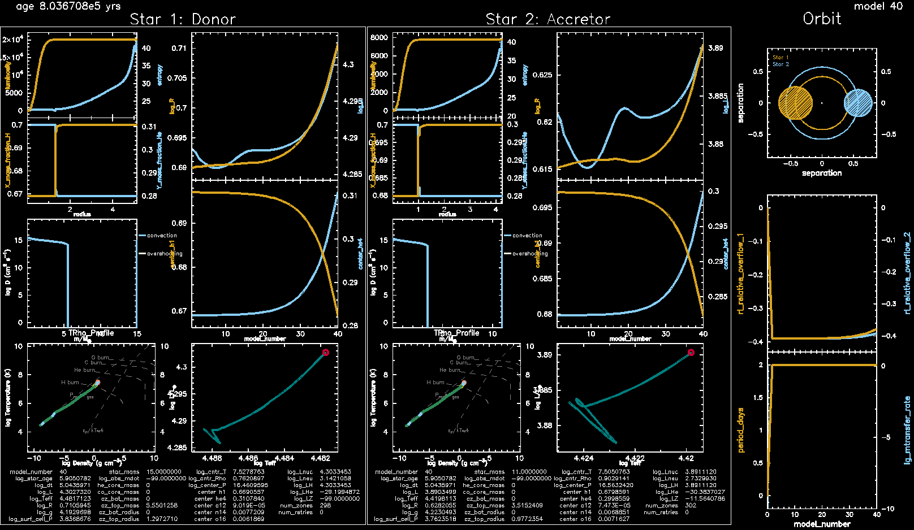

credit: ESO/L. Calçada

# Introduction

[Lab1](./Lab1.html)

[Lab2](./Lab2.html)

[Lab3](./Lab3.html)


[HELP LINK for website building](./help.html)

[Google drive link to download Thursday Lab Materials](https://drive.google.com/drive/folders/1yFy2I7kBh6UZPYmhFxkZswQVPI0Qavjc?usp=share_link)

[Link to Lab Solutions](https://drive.google.com/drive/folders/11WEpwn17_XuxKugH0B57OHMjby-jomUj?usp=share_link)


To begin, we make a copy of a desired pre-setup directory from the location `$MESA_DIR/binary/test_suite/evolve_both_stars`.

To make a copy, type the following in your terminal (or you can do it using the graphical user interface):

```plaintext
cp -r $MESA_DIR/binary/test_suite/evolve_both_stars Lab1_binary
cd my_thursday_lab
tree
```

To get an idea of what is inside `Lab1_binary` we can use the `tree` command.

The `tree` command shows the files contained in the `Lab1_binary` directory and its subdirectories.

If your terminal does not have `tree` installed, you  can do it by executing

```
brew install tree (on mac)
or
sudo apt-get install tree (on linux)
```
It's alright if you don't have `tree` or cannot download it, `ls` should suffice.

`tree ./Lab1_binary` should return the following.

```shell
├── clean
├── inlist
├── inlist1
├── inlist2
├── inlist_pgbinary
├── inlist_pgstar
├── inlist_project
├── make
│   └── makefile
├── mk
├── history_columns.list
├── profile_columns.list
├── re
├── rn
└── src
    ├── binary_run.f90
    ├── run_binary_extras.f90
    └── run_star_extras.f90

3 directories, 16 files
```


All other files are briefly described in the table below

### MESA BINARY work directory

| Filename                | Description       |
|:------------------------|:------------------|
| `clean`                 | description       |
| `inlist`                | description |
| `inlist1`               | description   |
| `inlist2`               | description     |
| `inlist_pgbinary`       | description      |
| `inlist_pgstar`         | description      |
| `inlist_project`        | description |
| `make/`                  | description   |
| `mk`                    | description      |
| `history_columns.list`  | description |
| `profile_columns.list`       | description     |
| `re`                    | description      |
| `rn`                    | description      |
| `src/`                   | description      |
| `binary_run.f90`        | description      |
| `run_binary_extras.f90` | description      |
| `run_star_extras.f90`   | description      |

`inlist_project`, `inlist1`, and `inlist2` are the three main files that contain the microphysics information of our binary stellar evolution simulation.

### Setting the stellar parameters

#### Binary parameters

The `inlist_project` - which is relevant for binary parameters -  will look something like this

```plaintext
&binary_job

   inlist_names(1) = 'inlist1'
   inlist_names(2) = 'inlist2'

   evolve_both_stars = .true.

/ ! end of binary_job namelist

&binary_controls

   m1 = 15d0  ! donor mass in Msun
   m2 = 11d0 ! companion mass in Msun
   initial_period_in_days = 2d0

/ ! end of binary_controls namelist
```

and will allow us to set the binary parameters, e.g., the initial mass of the stars and their orbital period. The full list of available parameter for `&binary_job` can be found in the directory

```
$MESA_DIR/binary/defaults/binary_job.defaults
```

and those of `&binary_controls` can be found in

```
$MESA_DIR/binary/defaults/binary_controls.defaults
```

If you would like to change any of these default values, just copy them to `inlist_project` and set the new values there.

#### Parameters of the component stars

Any (non-default) values for the parameters of the individual stars will be set in the `inlist1` (for primary star) and `inlist2` (for secondary star) files. The more massive star is considered as the primary star and dictates the initial evolution of the binary system. An example of the contents in `inlist1` is

```plaintext
&star_job

      show_log_description_at_start = .false.
      save_model_when_terminate = .true.
      save_model_filename = 'final1.mod'

/ ! end of star_job namelist

&eos

/ ! end of eos namelist

&kap

      Zbase = 0.02

/ ! end of kap namelist


&controls
      profile_interval = 50
      history_interval = 10
      terminal_interval = 1
      write_header_frequency = 10
      
      ! reduce resolution and solver tolerance to make runs faster
      mesh_delta_coeff = 3d0
      time_delta_coeff = 3d0
      varcontrol_target = 1d-2

/ ! end of controls namelist


&pgstar
   read_extra_pgstar_inlist(1) = .true.
   extra_pgstar_inlist_name(1)= 'inlist_pgstar'

/ ! end of pgstar namelist
```

Many other (default) parameters which are not modified in the above inlist can be found in the directory

```
$MESA_DIR/star/defaults/
```

As before copy the relevant parameter you wish to change to `inlist1` before making the change. Similarly, `inlist2` contains the parameters of star 2.

#### Setting values for an initial run

Here, we will run our first model. For this, we need to set the masses of the stars in the binary and the binary's orbit period. Choose a desired value and then execute the below commands in your terminal

```
./mk
./rn
```

#### Terminal Output

On executing the above commands, MESA will print the model output on the terminal. After each step the new updated values of the binaries parameters would be printed to the display. An example output is shown in Fig. 2.


#### Pgstar Output

A picture is worth a thousand words

, so rather than reading the output from the terminal, at times, an intuitive understanding of stellar evolution can be grasped from a diagram. The `Pgstar` module does exactly that. It plots the model output in real-time - depending on the chosen step size.

We can turn on the `pgbinary` plots by uncommenting the following line in `&starjob`. followed by `./rn`

```
!   pgbinary_flag = .true.
```

This run should return a nice pgbinary plot showing the evolution of both primary and secondary in one panel, with a nice orbital seperation diagram in the top right corner.




#### Finding and fixing a bug in MESA (see [gh-issue-634](https://github.com/MESAHub/mesa/issues/634))

Let's try running this model in the single star mode, so open `inlist_project` and set `evolve_both_stars = .false.`.

Now, run your model again and take note of what happens to you or the people around you. What computer are you using?

If you're running on an apple arm cpu (e.g. M1), there should be no issue.
However, if you're running using the intel fortran compilers, chances are pgbinary probably crashed your simulation with the following error:

```
Program received signal SIGSEGV: Segmentation fault - invalid memory reference.

Backtrace for this error:
#0  0x1550fd0437f2 in ???
#1  0x1550fd042985 in ???
#2  0x1550fc470acf in ???
#3  0x1550fc4f21e9 in ???
#4  0x1550fd350a33 in ???
#5  0x1550fd351163 in ???
#6  0x1550fd306679 in ???
#7  0x1550fd3094df in ???
#8  0x1550fd3096e8 in ???
#9  0x1550fd3091cb in ???
#10  0x1550fd30975e in ???
#11  0x1550fd344b8a in ???
#12  0x49658c in __pgbinary_orbit_MOD_orbit_panel
	at ../private/pgbinary_orbit.f90:240
#13  0x48f539 in __pgbinary_grid_MOD_grid_plot
	at ../private/pgbinary_grid.f90:537
#14  0x4929f5 in __pgbinary_grid_MOD_grid1_plot
	at ../private/pgbinary_grid.f90:61
#15  0x42a767 in __pgbinary_MOD_onscreen_plots
	at /home1/rhirai/MESA/mesa-r24.03.1/binary/make/pgbinary.f90:878
#16  0x42a96d in __pgbinary_MOD_do_pgbinary_plots
	at /home1/rhirai/MESA/mesa-r24.03.1/binary/make/pgbinary.f90:764
#17  0x42d5a6 in __pgbinary_MOD_update_pgbinary_plots
	at /home1/rhirai/MESA/mesa-r24.03.1/binary/make/pgbinary.f90:85
#18  0x428efa in __run_binary_support_MOD_do_run1_binary
	at ../private/run_binary_support.f90:712
#19  0x40926c in __binary_lib_MOD_run1_binary
	at ../public/binary_lib.f90:72
#20  0x408bb8 in __run_binary_MOD_do_run_binary
	at /home1/rhirai/MESA/mesa-r24.03.1/binary/job/run_binary.f90:7
#21  0x408bd4 in binary_run
	at ../src/binary_run.f90:4
#22  0x408c0b in main
	at ../src/binary_run.f90:2
./rn1: line 6: 49640 Segmentation fault      (core dumped) ./binary
DATE: 2024-04-04
TIME: 12:48:18
finished 
```

How do we fix this bug? 

Notice that the fortran backtrace error we are recieving points to `../private/pgbinary_orbit.f90:240`. Using this information open `$MESA_DIR/star/private/pgbinary_orbit.f90` with your favorate text editor and find line 240, which should read

```fortran
call pgline(2 * num_points + 1, x2s_RL, y2s_RL)
```

What seems to be happening?

When MESA binary runs in single star mode, it appears that X2s_RL and y2s_RL are unset in the `pgbinary_orbit` panel.
To solve this issue, we can set these variables by adding the following just below line 205 in `pgbinary_orbit.f90`.

```fortran
 else
     x2s_RL = 0d0
     y2s_RL = 0d0
```

These should appear on lines 206-208, With lines 198-212 shown below, in context.

```fortran
            do i = 1, num_points  ! displace the xs
               x2s_RL(i) = -(x2s_RL(i) - a2 * (1 - e))  ! flip x for 2nd star!
               x2s_RL(2 * num_points - i + 1) = x2s_RL(i)
            end do
            x2s_RL(2 * num_points + 1) = x2s_RL(1)
             y2s_RL(2 * num_points + 1) = y2s_RL(1)
             x2max = maxval(abs(x2s_RL))
             xmax = max(x2max, xmax)
          else
             x2s_RL = 0d0
             y2s_RL = 0d0
          end if
       else if (b% pg% Orbit_show_RL .and. abs(log10(q)) > 2) then
          write(*, 1) "pgbinary: Not plotting RL, q too extreme: abs(log(q)) = ", abs(log10(q))
      end if
```

Save the file and navigate backward into the `$MESA_DIR/star` directory. Next, let's recompile MESA star and export our changes with the following commands.

```
cd $MESA_DIR/star/
./mk
./export
```
**If you are having trouble correctly modifying pgbinary.f90, feel free to download the [pgbinary.f90 solution here](https://drive.google.com/file/d/1r-AA9a-MjCdpmw3QaMxfVrqTEMv0NMqK/view?usp=share_link), and replace the file.**

Now let's navigate back into our Lab1_binary directory, recompile MESA star, and run our binary model again.

```
./clean
./mk
./rn
```

pgbinary should no longer crash!


