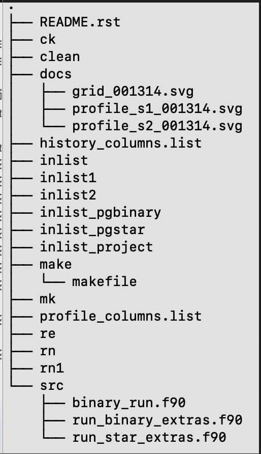

# Introduction

To begin, we make a copy of a desired pre-setup directory from the location `$MESA_DIR/binary/test_suite/evolve_both_stars`.

To make a copy, type the following in your terminal (or you can do it using the graphical user interface):


Text can be **bold**, _italic_, or ~~strikethrough~~.

[Lab1](./Lab1.html)

[Lab2](./Lab2.html)

[Lab3](./Lab3.html)


[HELP LINK for website building](./help.html)

[Google drive link to download Thursday Lab Materials]([./help.html](https://drive.google.com/file/d/1kuKGSnNPDEjx45ahGyltGhIJtdvJF_jC/view?usp=share_link))


To begin, we make a copy of a desired pre-setup directory from the location

```
$MESA_DIR/binary/test_suite/evolve_both_stars
```

To make a copy, type the following in your terminal (or you can do it using the graphical user interface)

```
cp - r $MESA_DIR/binary/test_suite/evolve_both_stars my_thursday_lab
cd my_thursday_lab
tree
```

The `tree` command would show the files contained in the `my_thursday_lab` directory and its subdirectories as shown in Fig. 1.



If your terminal does not have `tree` installed, you  can do it by executing

```
brew install tree (on mac)
or
sudo apt-get install tree (on linux)
```

### Setting the stellar parameters

In Fig. 1, there are three main files that will contain the information of the various physical properties that we would like our stars to have. These are `inlist_project`, `inlist1`, and `inlist2`.

#### Binary parameters

The `inlist_project` - which is relevant for binary parameters -  will look something like this

```plaintext
&binary_job

   inlist_names(1) = 'inlist1'
   inlist_names(2) = 'inlist2'

   evolve_both_stars = .true.

/ ! end of binary_job namelist

&binary_controls

   m1 = 15d0  ! donor mass in Msun
   m2 = 11d0 ! companion mass in Msun
   initial_period_in_days = 2d0

/ ! end of binary_controls namelist
```

and will allow us to set the binary parameters, e.g., the initial mass of the stars and their orbital period. The full list of available parameter for `&binary_job` can be found in the directory

```
$MESA_DIR/binary/defaults/binary_job.defaults
```

and those of `&binary_controls` can be found in

```
$MESA_DIR/binary/defaults/binary_controls.defaults
```

If you would like to change any of these default values, just copy them to `inlist_project` and set the new values there.

#### Parameters of the component stars

Any (non-default) values for the parameters of the individual stars will be set in the `inlist1` (for primary star) and `inlist2` (for secondary star) files. The more massive star is considered as the primary star and dictates the initial evolution of the binary system. An example of the contents in `inlist1` is

```plaintext
&star_job

      show_log_description_at_start = .false.
      save_model_when_terminate = .true.
      save_model_filename = 'final1.mod'

/ ! end of star_job namelist

&eos

/ ! end of eos namelist

&kap

      Zbase = 0.02

/ ! end of kap namelist


&controls
      profile_interval = 50
      history_interval = 10
      terminal_interval = 1
      write_header_frequency = 10
      
      ! reduce resolution and solver tolerance to make runs faster
      mesh_delta_coeff = 3d0
      time_delta_coeff = 3d0
      varcontrol_target = 1d-2

/ ! end of controls namelist


&pgstar
   read_extra_pgstar_inlist(1) = .true.
   extra_pgstar_inlist_name(1)= 'inlist_pgstar'

/ ! end of pgstar namelist
```

Many other (default) parameters which are not modified in the above inlist can be found in the directory

```
$MESA_DIR/star/defaults/
```

As before copy the relevant parameter you wish to change to `inlist1` before making the change. Similarly, `inlist2` contains the parameters of star 2.

#### Setting values for an initial run

Here, we will run our first model. For this, we need to set the masses of the stars in the binary and the binary's orbit period. Choose a desired value and then execute the below commands in your terminal

```
./mk
./rn
```

#### Terminal Output

On executing the above commands, MESA will print the model output on the terminal. After each step the new updated values of the binaries parameters would be printed to the display. An example output is shown in Fig. 2.


#### Pgstar Output

A picture is worth a thousand words

, so rather than reading the output from the terminal, at times, an intuitive understanding of stellar evolution can be grasped from a diagram. The `Pgstar` module does exactly that. It plots the model output in real-time - depending on the chosen step size.
```

